# Testplan opdracht 2 - WISA

Auteur(s) testplan: Sven de Windt

## Voorbereiding

Voor onduidelijkheden vind je meer context de [team handleiding](./readme.md).  

* Download of clone de git repository naar een lokale drive met voldoende schijfruimte.
* Download de installatie files voor PasswordState vanaf [deze](https://passwordstate-8665.kxcdn.com/passwordstate.zip) link en sla ze op. Pak de bestanden uit in de `./resources` folder in de folder waar je de repository gekloond hebt.

## Tests

### Webserver

In de folder waar de Vagrantfile bewaard wordt, voer het commando `Vagrant up` uit.

| Verwachte uitvoer     | Effectieve uitvoer of OK  |
| :---                  | :---                      |
| Een werkende VM       |                           |

De virtuele machine (vm) is nu reeds geïnstalleerd en is klaar voor gebruik. Om te zien of de services draaien kunnen we via Vagrant met powershell aanmelden op de machine.

```powershell
vagrant powershell
```

We zijn nu ingelogd in de vm. Voer volgende commando's uit.

| Commando                      | Verwachte uitvoer     | Effectieve uitvoer of OK  |
| :---                          | :---                  | :---                      |
| `get-service mssqlserver`     | Status: running       |                           |
| `get-service w3svc`           | Status: running       |                           |

### Demo Applicatie

Log aan op de Server met de user `.\administrator` en het wachtwoord `vagrant`. Blader naar de map `c:\vagrant_data\resources\`. In deze map hebben we in de voorbereiding de installatie files van PasswordState gedownload.

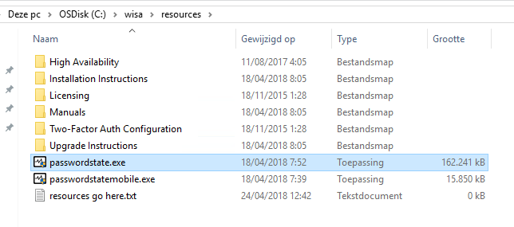

Start `passwordstate.exe`, de installatie begint.

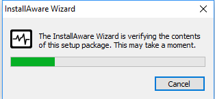

Op het welkom scherm, klik `Next`;

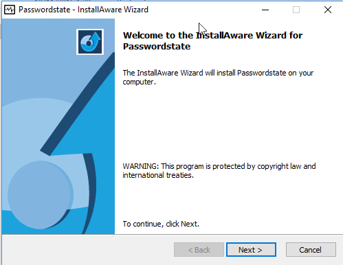

Ga akkoord met de End User License Agreement (EULA) en klik `Next`

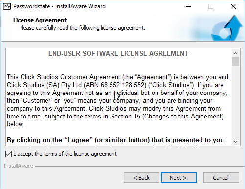

Klik `Next` op het destination folder scherm

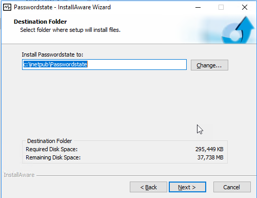

Pas de poort aan naar `443` in het Specify Web Site URL and Port Number venster. Noteer dat we hier de url kiezen om straks te benaderen. (https://wisa). We moeten er straks voor zorgen dat de naam wisa geresolved wordt naar deze vm. Klik `Next`

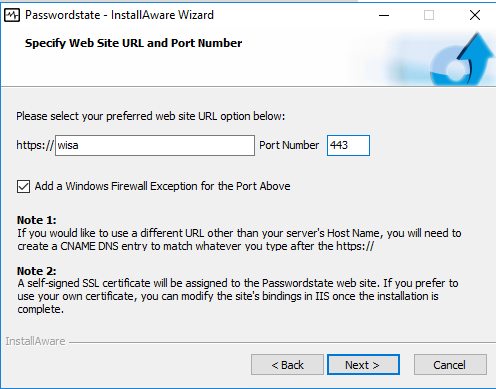

Start de installatie door op `Next` te klikken.

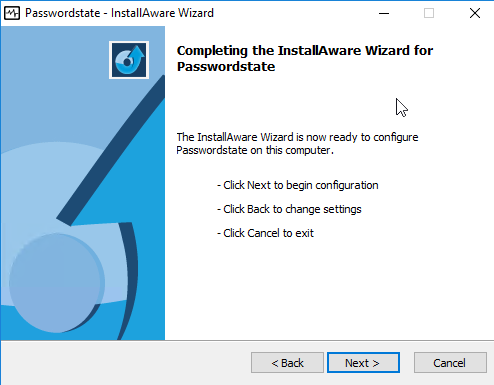

De installatie wordt uitgevoerd.

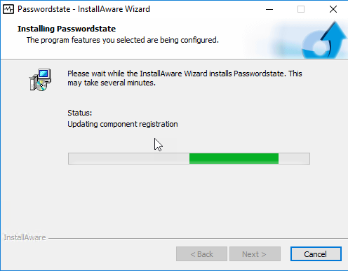

Klik op `Finish` om de installatie te voltooien.  
Nu moeten we de installatie nog configureren. We zorgen eerst dat ons host systeem de naam `wisa` omzet in 127.0.0.1. Voeg daarom een lijn toe in de `hosts` file in `c:\windows\system32\drivers\ets\hosts` op het **host** systeem. Hiervoor heb je een administratieve notepad nodig.

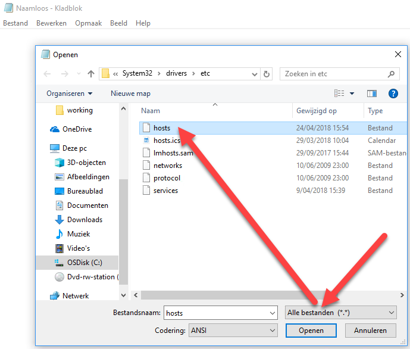
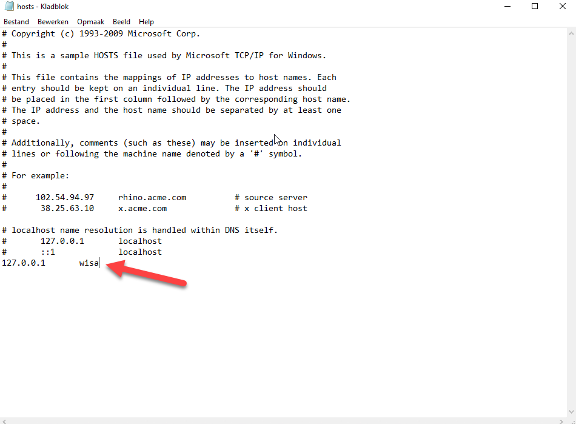

Nu kunnen we browsen naar https://wisa in een browser op de **host**.  
Er komt een waarschuwing dat de verbinding niet veilig is. Dit is juist er wordt een self signed certificate gebruikt. 

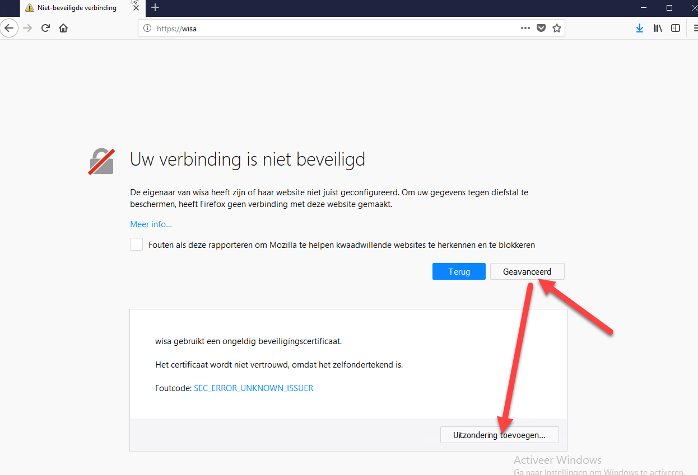

Bevestig de uitzondering

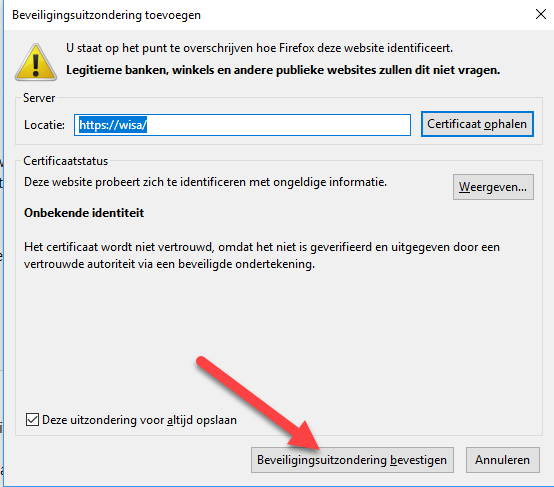

Nu kunnen we de installatie verder configureren. In het welkomst scherm klik `begin`.

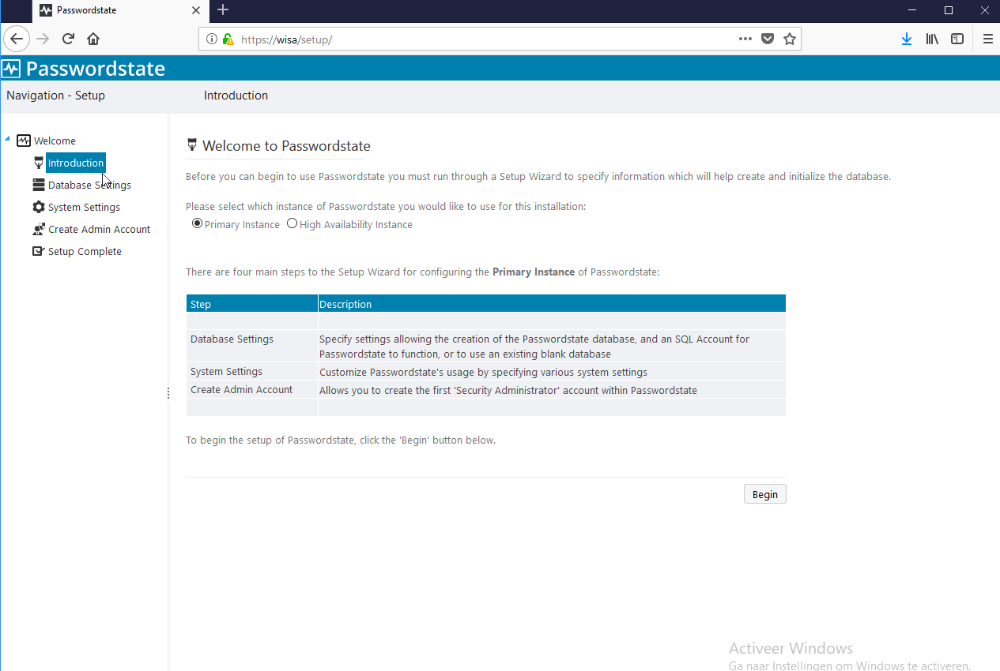

Op het Database Settings scherm vul volgende velden in

| veld                  |           |
| :---                  | :---      |
| Database server name  | `wisa`    |
| SQL Login Name        | `sa`      |
| Password              | `vagrant` |

Klik op `Test Connection` en vervolgens op `Next`

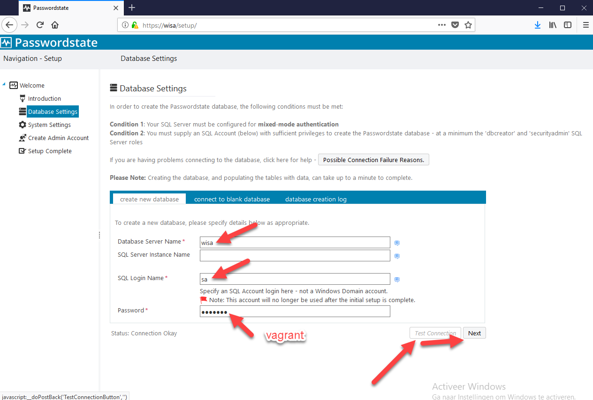

Op de System Settings pagina kiezen we voor Forms Based Authentication. We hebben geen Active Directory. Verder vullen we het wachtwoord in voor de  Emergency Access Account. (`vagrant`). Klik `next`.

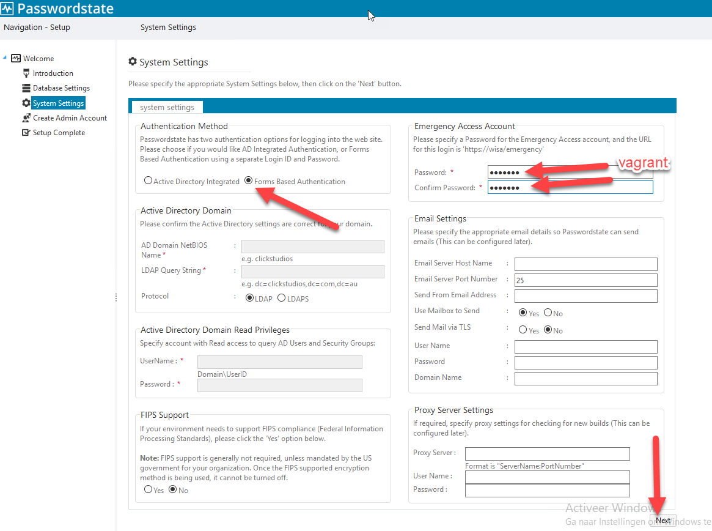

Op de Create Admin Pagina tenslotte geven we de credentials van de Admin op. Bij wijze van demo kunnen we hier als UserID, firstname en password `vagrant` gebruiken.  
Klik `next`.


Exporteer nog de encryptions keys door op de knop `Export Encryption Keys` te klikken. Geef een wachtwoord op (`vagrant`) en klik `Export Keys`. Sla het bestand ergens veilig op.  

Klik op `Start Passwordstate`.  

We kunnen nu gebruik maken van Passwordstate door aan te melden met `vagrant` als username en `vagrant` als wachtwoord.

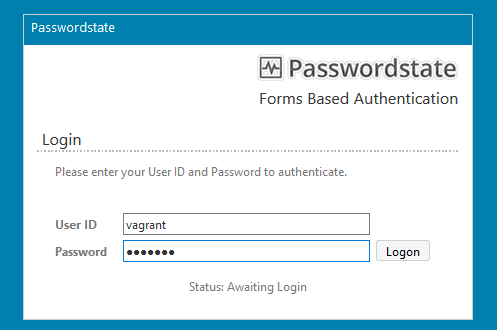

We zijn ingelogd en krijgen meteen een rondleiding.

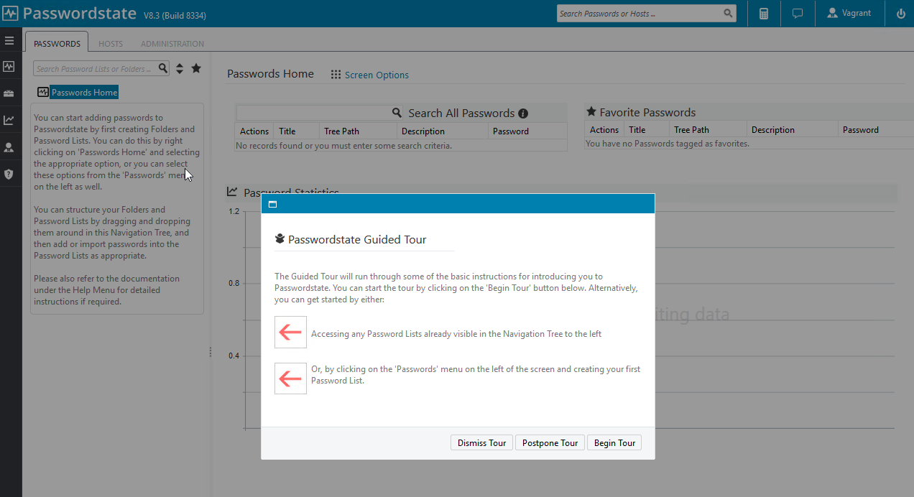

Nu hebben we een ASP.net web applicatie geïntalleerd.
